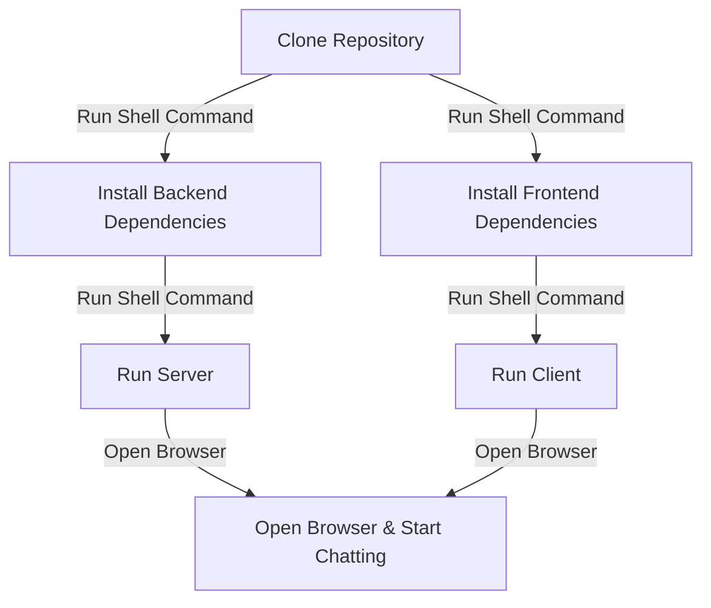

Socket.io Real-Time Chat Application

A real-time chat application built using React (Create React App) and Socket.io.

📌 Features

Real-time messaging using Socket.io

Modern UI with React.js

Backend powered by Node.js & Express

User-friendly and scalable

🚀 Installation & Setup

1️⃣ Clone the Repository
```sh
git clone https://github.com/your-username/your-repo.git
cd your-repo
```
2️⃣ Install Dependencies

For Client (React Frontend)
```sh
cd client
npm install
```
If you encounter ajv issues, install manually:
```sh
npm install ajv --save
```
For Server (Backend)
```sh
cd ../server
npm install
```
3️⃣ Run the Application

Start the Server
```sh
cd server
npm start
```
Start the Client
```sh
cd client
npm start
```
Now, open http://localhost:3000 to access the chat application.

📊 Project Structure

socket-io-chat-app/
#### ├── client/       # Frontend (React)
#### ├── server/       # Backend (Node.js & Express)
#### ├── package.json  # Dependencies
#### └── README.md     # Documentation

🔧 Troubleshooting

❌ error:0308010C:digital envelope routines::unsupported

Fix: Add the following to your .env or start script:

NODE_OPTIONS=--openssl-legacy-provider

❌ Cannot find module 'ajv/dist/compile/codegen'

Fix: Install ajv manually:
```sh
npm install ajv --save
```
📌 Installation Process (Mermaid Diagram)

📜 License

This project is licensed under the MIT License.

📂 Shell Commands for Quick Setup

Clone and Navigate
```sh
git clone https://github.com/your-username/your-repo.git
cd your-repo
```
Install Backend
```sh
cd server
npm install
```
Install Frontend
```sh
cd ../client
npm install
```
Run Server
```sh
cd ../server
npm start
```
Run Client
```sh
cd ../client
npm start
```

## N/B 
you must open using 2 browsers so that you chat seemlessly and and the room ID should be the same 
